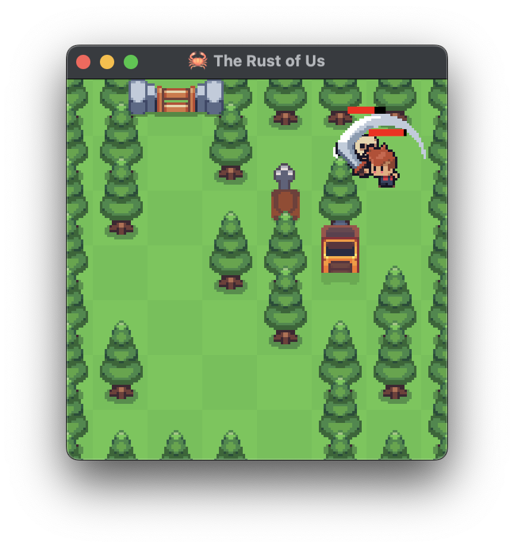
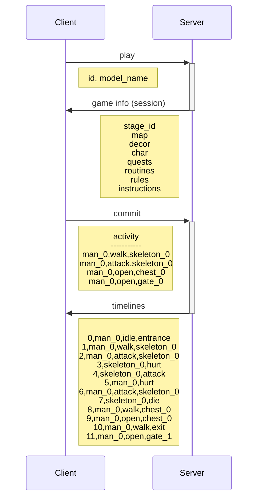

# The Rust of Us



> [!WARNING]  
> The code is not production ready, only for learning and enjoy hackathon purpose.

"The Rust of Us" is an RPG game where AI characters can join, live their lives, and survive a zombie apocalypse.

## Setup

```
cargo install cargo-watch
cargo install wasm-bindgen-cli
```

## Dev

```
cargo watch -c -w src -x run

# or more trace
cargo watch -c -w src -s "RUST_LOG=the_rust_of_us=trace cargo run --features=trace"

# or with dynamic linking (no Wasm)
cargo watch -c -w src -x "run --features bevy/dynamic_linking"
```

## Build

```
# for web
cargo build --release --target wasm32-unknown-unknown

# noted for `bevy_egui::manage_clipboard` via `bevy-inspector-egui`
RUSTFLAGS=--cfg=web_sys_unstable_apis cargo build --release --target wasm32-unknown-unknown
```

## Notes



## PERKS

- [ ] Boost health power.
- [ ] Boost attack power.
- [ ] Boost eye sight.

## TODO

- [ ] Show SAVE as NFT.
- [ ] Connect wallet.
- [ ] Record map and message on NFT.
- [ ] Show on big map 256x256.
- [ ] Gen more stage map via llm and eval then cache.

## TOHAVE

- [ ] Record on KV and NFT as a fallback.
- [ ] Offer ai to choose behavior and task. e.g. explore north, find treasure, avoid monster.
- [ ] Gen next move by llm.
- [ ] Show model name.
- [ ] Cut scene show owner and their message. // render like x ss
- [ ] [MENU] Allow to add `API_URI`, `API_KEY`.
- [ ] Logic gates quiz
- [ ] Move stone to open path way.
- [ ] Move stone to toggle switch.
- [ ] Avoid fire. // walkable but hurt
- [ ] Avoid arrow trap.
- [ ] Learn from previously trap (don't step on it again!).
- [ ] Use key to open chest.
- [ ] Find the right key to open chest.
- [ ] Find the right path to avoid monster.

## Resources

- [x] Unofficial Bevy Cheat Book: https://bevy-cheatbook.github.io/programming/bundle.html
- [x] Assets: https://x.com/DanielDiggle/status/1830297625452806371?t=cLYMikMGynFuZH1lozaTxg
- [x] For sprite scene layer: https://github.com/deifactor/extol_sprite_layer
- [x] For character animation clip: https://github.com/merwaaan/bevy_spritesheet_animation
- [x] Bevy ECS Markers: https://github.com/ChoppedStudio/bevy_ecs_markers
- [x] Floating statbars like health bars: https://github.com/adrien-bon/bevy_stat_bars
- [x] 2d tiled map: https://github.com/443eb9/bevy_entitiles
- [x] CSV: https://github.com/BurntSushi/rust-csv
- [x] A\* Pathfinding: https://github.com/nikhilhenry/astar.rs
- [x] [big-brain] Utility AI library for the Bevy game engine: https://github.com/zkat/big-brain
- [ ] [🍃 Bevy Tweening]: https://github.com/djeedai/bevy_tweening
- [x] [bevy-inspector-egui]: https://github.com/jakobhellermann/bevy-inspector-egui
- [ ] [bevy_local_storage]: https://github.com/robertdodd/bevy_local_storage
- [ ] https://github.com/umut-sahin/bevy-persistent
- [ ] https://github.com/johanhelsing/bevy_pkv

## Wasm

- [ ] https://github.com/topheman/bevy-rust-wasm-experiments
- [ ] https://github.com/ndinata/rust-wasm-vite
- [ ] https://github.com/mvlabat/bevy_egui
- [ ] https://github.com/rwasm/vite-rsw-wasm-template
- [ ] https://bevy-cheatbook.github.io/platforms/wasm.html
- [x] https://github.com/trunk-rs/trunk
- [ ] https://github.com/katopz/yew-dapp-examples

## Js

```
const {publicKey} = await window.solana.connect();
console.log(publicKey.toString());
```
