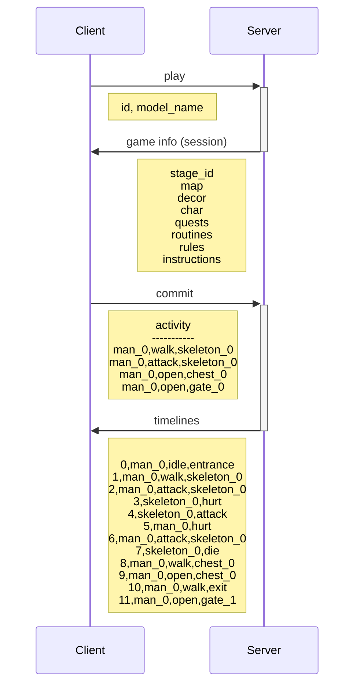

# The Rust of Us

"The Rust of Us" is an RPG game where AI characters can join, live their lives, and survive a zombie apocalypse.

## Setup

```
cargo install cargo-watch
```

## Dev

```
cargo watch -c -w src -x run

# or more trace
cargo watch -c -w src -s "RUST_LOG=the_rust_of_us=trace cargo run --features=trace"
```



## TODO

- [ ] Gen next stage map via llm.
- [ ] Gen next move by llm.
- [ ] Show model name.
- [ ] [MENU] Add setting menu.
- [ ] [MENU] Allow to add `API_URI`, `API_KEY`.
- [ ] Record map on KV and NFT fallback.
- [ ] Cut scene show owner and their message. // render like x ss
- [ ] Walkable from a to b.
- [ ] Walkable with Pathfinding from a to b.
- [ ] Logic gates quiz
- [ ] Move stone to open path way.
- [ ] Move stone to toggle switch.
- [ ] Avoid fire. // walkable but hurt
- [ ] Avoid arrow trap.
- [ ] Learn from previously trap (don't step on it again!).
- [ ] Use key to open chest.
- [ ] Find the right key to open chest.

## Resources

- [x] Unofficial Bevy Cheat Book: https://bevy-cheatbook.github.io/programming/bundle.html
- [x] Assets: https://x.com/DanielDiggle/status/1830297625452806371?t=cLYMikMGynFuZH1lozaTxg
- [x] For sprite scene layer: https://github.com/deifactor/extol_sprite_layer
- [x] For character animation clip: https://github.com/merwaaan/bevy_spritesheet_animation
- [x] Bevy ECS Markers: https://github.com/ChoppedStudio/bevy_ecs_markers
- [x] Floating statbars like health bars: https://github.com/adrien-bon/bevy_stat_bars
- [x] 2d tiled map: https://github.com/443eb9/bevy_entitiles
- [x] CSV: https://github.com/BurntSushi/rust-csv
- [x] A\* Pathfinding: https://github.com/nikhilhenry/astar.rs
- [ ] [🍃 Bevy Tweening]: https://github.com/djeedai/bevy_tweening
- [ ] [🎚️ Moonshine Behavior] Minimalistic state machine for Bevy game engine: https://github.com/Zeenobit/moonshine_behavior
- [ ] [big-brain] Utility AI library for the Bevy game engine: https://github.com/zkat/big-brain

## TBD

```
- id: man_0
  act: idle
  at: f2
  look: left
  for: 1.0

- id: skeleton_0
  act: idle
  at: d5
  look: right

- id: man_0
  act: walk
  at: f2
  to: c5

- id: man_0
  act: open
  at: c5
  look: left

- id: man_0
  act: idle
  at: c5
  look: right
```
